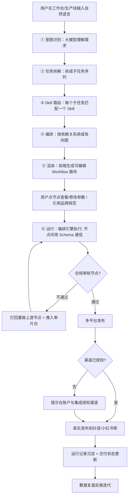

# VisionAgent 产品需求文档（PRD）

> 版本：v0.5.0（一期打通版 · 含 M3 落地设计 + 真实能力验证 + 闭环交互 + 图像/抠图/审核 API 接入 + 编排层健壮性）　|　作者：产品组　|　最后更新：2026-08-12　|　状态：原型阶段（前端 Demo，11 页可交互）＋ 真实可运行 Agent 已验证 ＋ 线上 Demo（GitHub Pages + 腾讯云 SCF）真·多模型调用打通 ＋ 真实抠图/出图/合规审核已接入 ＋ 闭环交互已实现

---

## 1. 文档信息

| 项 | 内容 |
|---|---|
| 产品名 | **VisionAgent**（视觉内容智能体生产线） |
| 文档类型 | 产品需求文档 PRD |
| 当前阶段 | 方案设计 + 前端可行性验证（6 个视觉节点真接 API；运行记录/成本/模板已切换为真实数据驱动，仅发布 OAuth 与部分大盘指标仍为 mock） |
| 阅读对象 | 研发、设计、评审决策者、作品集展示 |
| 关联交付物 | 可交互前端原型（11 页）、Skill 能力库、Workflow 画布、业务流程图、已部署公开 Demo |
| 变更记录 | v0.3→v0.4：新增「账户与集成 / 审片台 / 运行记录 / 品牌中心」4 页；生产线支持存为模板；引入角色权限视图；全站移动响应式；闭合"搭建→运行→审核→发布→复盘"主链路。v0.4.1：新增第 11 节「M3 后端落地设计（研发视角 + NL 生成 PM 定义清单）」 |

---

## 2. 产品概述

### 2.1 一句话价值主张
**用一句话描述你的视觉内容生产流程，VisionAgent 自动拆任务、匹配技能、生成可编辑、可复用的智能体"生产线"。**

### 2.2 我们要解决什么痛点
视觉内容团队（摄影师/工作室、电商商家、餐饮/地产/广告运营）的核心痛点**不是"创作"，而是"拍完/生产完之后"的重复苦活**：抠图、调色、按平台规格出图、客户审片、内容分发、数据复盘。这些环节跨工具、靠人工、易出错、难复用。

### 2.3 产品定位
- **品类**：AI 智能体 / Workflow 搭建平台（与 Coze、Dify 同大类）。
- **切口**：**视觉内容垂直场景**——把通用 Agent 平台的"横向能力"落到"图像/视频生产流水线"这个深水区。
- **定位话术**：以**摄影为首选深耕行业**，平台能力可横向复制到电商、餐饮、地产、广告、自媒体等任意视觉内容团队。
- **平台 vs 业务**：用户不写代码，用"选 Skill + 拼生产线 + 自然语言生成"的方式搭建，平台提供能力原子与编排引擎。

### 2.4 为什么是现在 / 市场逻辑
- 图像/视频生成模型成熟，但"把模型串成业务流水线"仍靠研发硬编码。
- 视觉内容团队付费意愿强（省时间 = 接更多单），是清晰的 B 端 / 创作者变现场景。
- 窄切入（摄影）→ 打透 → 横向复制，是标准且稳妥的 GTM 策略。

---

## 3. 目标用户与场景

### 3.1 用户画像
| 角色 | 特征 | 典型诉求 |
|---|---|---|
| 摄影师 / 摄影工作室主 | 会拍不会写代码，苦于后期与交付 | 客片批量修图、客户审片打回、成片分发 |
| 电商商家 / 运营 | 海量商品图，上新频繁 | 商品图批量出图、统一调性、多平台规格 |
| 餐饮 / 地产 / 广告运营 | 需要标准化视觉物料 | 探店图、空间图、广告海报批量生产 |
| 自媒体创作者 | 多平台分发，求效率 | 横竖版剪辑、标题文案、数据复盘反推选题 |
| 平台管理员 | 负责渠道授权、成员权限、额度 | 集成抖音/小红书等渠道、控制成员视图、查看用量 |

### 3.2 核心场景（一条生产线的完整生命周期）
1. **搭建**：自然语言描述 → 自动生成生产线（或复用模板）；好用的线可**一键存为模板**复用/分享。
2. **运行**：素材入库 → 节点依次执行（分类/抠图/调色/合规/分发）；每条运行有**运行记录**（节点日志、耗时、成本）。
3. **审核**：合规节点不通过 → **自动打回重做**（带反馈闭环）；同时推入**审片台**，由人工看大图 + 批注 + 通过/打回。
4. **发布**：合规通过后 → 调用**已授权的渠道**（抖音/小红书/视频号/微信/淘宝）真实发布；渠道授权在「账户与集成」统一管理。
5. **品牌一致性**：调色/文案类 Skill 可引用**品牌中心**的规范（色板/字体/Logo/禁用项），保证批量产出调性统一。
6. **复盘**：运行记录与交付状态回流 → 反推选题 / 参数优化（评测体系）。

---

## 4. 核心概念定义
| 概念 | 定义 | 在原型中的体现 |
|---|---|---|
| **Skill（技能）** | 平台能力原子：一个明确输入/输出的封装能力（如"AI 调色"）。背后可接模型 API 或脚本。 | 技能工坊内置 8 个 + 支持自定义开发 |
| **Agent 节点** | 一个 Skill + 它的参数 + 待处理数据，是生产线上最小的执行单元 | Workflow 画布中的圆角节点 |
| **Workflow / 生产线** | 节点间用连线拼成有向图，支持分支与循环（打回重做） | 生产线画布 |
| **分支打回** | 条件节点（如合规审核）输出"不通过"时回退到上游重做 | 合规审核节点的红色回退箭头 + 审片台打回动作 |
| **模板** | 预设好的生产线，一键复用、可改；用户自建线可"存为模板"沉淀 | 模板中心（8 个跨行业模板 + 用户沉淀） |
| **品牌规范** | 品牌色/字体/Logo/禁用元素集合，供调色/文案 Skill 引用 | 品牌中心（v0.4 新增） |
| **渠道集成** | 第三方平台（抖音/小红书等）的 OAuth 授权，使"发布"节点可真正触达 | 账户与集成页（v0.4 新增） |
| **运行记录** | 单次生产线的执行快照：节点日志、耗时、成本、状态 | 运行记录台（v0.4 新增） |
| **角色视图** | 管理员/成员/只读三档，按角色控制页面可见性与编辑权限 | 顶栏角色切换（v0.4 新增） |

---

## 5. 产品功能架构（11 页）

产品采用**左侧导航 + 多页**结构（区别于通用 Agent 平台，导航长在视觉业务里）。v0.4 由 7 页扩展为 11 页，补齐全生命周期闭环与账户层。

| 页码 | 名称 | 核心功能 | 对应参考项目厚度 |
|---|---|---|---|
| 1 | **工作台** | 概览数据卡 + 最近生产线 + 自然语言快速开始 | 首页 |
| 2 | **生产线** | Workflow 画布：自然语言生成、节点编辑、分支连线、**存为模板** | 画布 |
| 3 | **技能工坊** | 内置视觉 Skill + **自定义 Skill 开发**（代码编辑器+入参出参+调试+发布校验） | 能力池 + 自定义扩展 |
| 4 | **素材库** | 图片/视频素材管理、规格预览（替代通用"知识库"，更贴视觉业务） | 知识库（原生重构） |
| 5 | **模板中心** | 8 个跨行业生产线模板（电商/餐饮/摄影/地产/广告/旅拍/自媒体/活动）+ 用户沉淀模板 | 模板市场 |
| 6 | **交付管理** | 客户成片交付状态追踪（运行中/待审片/已打回重做），**可跳转审片台**——摄影工作室独有，参考项目无 | 原创厚度 |
| 7 | **账户与集成** | 个人中心（用量/套餐/API Key）+ **渠道 OAuth 授权**（抖音/小红书/视频号/微信/淘宝） | 原创厚度（补"发布悬浮"漏洞） |
| 8 | **审片台** | 待审片/待重做列表 → 看大图 + 批注 + **通过/打回**——让"分支打回"有真实人工落点 | 原创厚度（审核闭环） |
| 9 | **运行记录** | 历史运行列表 + 节点级日志 + 耗时/成本——对应 PRD"评测体系" | 原创厚度（复盘闭环） |
| 10 | **品牌中心** | 品牌色/字体/Logo/禁用元素，供调色/文案 Skill 引用——通用性从"单点流水线"升级为"任意视觉团队品牌化生产平台" | 原创厚度（跨行业通用） |
| 11 | **设置** | 出图规格、默认模型、合规规则、团队成员 | 系统设置 |

> 全站支持**移动响应式**（≤880px 侧栏转顶栏、各区堆叠，审片台窄屏堆叠），支持外拍手机审片。

---

## 6. 核心用户流程（自然语言 → 生产线 → 审核 → 发布 → 复盘）



> 说明：原型阶段 ①②③④ 的"意图识别/拆解"现已由**真实大模型**驱动（扣子 / 多 LLM 路由，结构化 JSON 产出，非预设剧本）；真实的"视觉 Skill 调用"（智能抠图 / 出图 / 合规审核）也已接入 API。视频粗剪/配乐/字幕/相册生成仍为一期**模拟编排**（前端已如实标注），真出片待接媒资引擎（见第 10、11 节）。v0.5 已把"审片台 + 运行记录 + 渠道授权 + 品牌规范"做成可交互占位，闭环在 UI 层可见。

---

## 7. Skill 与路由设计

### 7.1 内置 Skill 能力池（一期真实接入状态）
| Skill | 输入 | 输出 | 业务 | 一期状态 |
|---|---|---|---|---|
| 图片分类 | 图片集 | 分类标签 | 通用 | ✅ 真实（通义千问 VL 看图打标签） |
| 智能抠图 | 图片 + 主体参数 | 去背景透明图 | 电商/摄影 | ✅ **真**（通义万相 `description_edit` 去背景换白底） |
| AI 调色 | 图片 + 风格参数（可引用品牌规范） | 调色图 | 通用 | ✅ 真实（万相 description_edit 重渲染） |
| 场景生成 | 图 + 场景描述 | 合成图 | 广告/地产 | ✅ **真**（万相图生图认素材 + 智谱兜底） |
| 视频粗剪 | 视频素材 | 粗剪草稿 | 旅拍/自媒体 | ⚠️ 模拟（未接媒资引擎） |
| 文案生成 | 主题 + 平台（可引用品牌规范） | 标题/文案 | 自媒体/广告 | ✅ 真实（底层 LLM 路由文生） |
| 合规审核 | 内容 + 规则 | 通过/不通过 + 原因 | 通用（质量门） | ✅ **真**（规则引擎 + 阿里云内容安全预留） |
| 多平台发布 | 成品 + 渠道（需渠道已授权） | 发布回执 | 通用 | 🟡 编排可见（渠道 OAuth 待后端） |

### 7.2 意图识别 → 路由逻辑（PM 需定义的护城河）
- 关键词 / 语义 → 行业判定（摄影/电商/餐饮…）→ 调用对应模板或新建。
- 子任务 → Skill 映射表（可配置）。
- 分支条件：如"合规不过 → 打回重做调色 / 重写文案"，条件由 PM 定义、研发实现。
- **渠道前置**：生产线"发布"节点执行前，需校验对应渠道已在「账户与集成」授权；未授权则在运行记录中提示，避免"发布空跑"。

### 7.3 自定义 Skill 开发（对齐参考项目深度）
用户在"技能工坊"自行扩展平台能力：
1. 填写元信息（名称、描述、业务标签、入参 Schema、出参 Schema）。
2. 在代码编辑器写逻辑（Python 3.11，含类型与必填校验）。
3. 实时调试面板：输入测试数据看输出。
4. **发布校验弹窗**：名称/参数/语法/测试用例/安全合规扫描 5 项依次通过方可发布。
5. 发布后版本管理：被生产线引用后升级需提示"所有引用此 Skill 的 Workflow 将自动更新"。

---

## 8. 数据结构与 API 对接方案（占位）

> 以下为前端 Demo 的对接契约占位，供研发直接开工。v0.4 在 v0.3 基础上新增 Channel / Brand / RunLog / Review / Role 实体。

**关键实体**
- `Skill`：{id, name, inputSchema, outputSchema, code, version, status}
- `ProductionLine`（生产线）：{id, name, nodes[], edges[], owner, status, fromTemplate?}
- `Node`：{id, skillId, params, position}
- `Asset`：{id, type, spec, source}
- `Channel`：{id, platform, authStatus, token, scopes}  // 账户与集成
- `Brand`：{id, name, palette[], fonts[], logo, forbidden[]}  // 品牌中心
- `RunLog`：{runId, lineId, status, nodeLogs[], cost, duration}  // 运行记录
- `Review`：{id, runId, asset, annotations[], decision}  // 审片台
- `Deliverable`：{lineId, asset, clientStatus}
- `Role`：{userId, role: admin|member|readonly, visiblePages[]}

**示例 API（REST 风格）**
```
POST /api/lines/generate      # 自然语言 → 生成生产线（意图识别+拆解+路由）
GET  /api/skills              # 技能能力池
POST /api/skills              # 自定义 Skill 发布（触发发布校验）
POST /api/lines/{id}/run      # 运行生产线
POST /api/lines/{id}/save-as-template  # 存为模板
GET  /api/deliverables        # 交付状态列表
GET  /api/channels            # 渠道授权列表
POST /api/channels/{p}/oauth  # 发起渠道 OAuth 授权
GET  /api/brands              # 品牌规范
GET  /api/runs                # 运行记录
POST /api/reviews/{id}/decide # 审片台通过/打回
GET  /api/me/usage            # 账户用量/套餐
```

---

## 9. 非功能性需求（占位）
- **权限（角色视图）**：管理员 / 成员 / 只读三档。成员不可见「设置」「账户与集成」；只读隐藏「技能工坊」「品牌中心」及所有编辑/发布按钮（原型顶栏可切换预览）。
- **合规**：内容安全审核为强制质量门；自定义 Skill 代码沙箱隔离。
- **渠道安全**：OAuth token 加密存储，按 scope 最小化授权，支持一键断开。
- **多端**：Web 响应式，窄屏（≤880px）侧栏转顶栏，审片台支持手机批注。
- **可扩展**：Skill 可插拔；模板可市场共享；品牌规范可被多 Skill 引用。
- **多租户 / 计费 / 运维**：商业化阶段补齐（当前原型不涉及）。

---

## 10. 竞品与差异化
| 维度 | Coze / Dify（通用） | VisionAgent（垂直） |
|---|---|---|
| 定位 | 通用 AI Bot / 工作流 | 视觉内容生产流水线 |
| 用户 | 开发者/运营/任何人 | 视觉内容团队（未必会写代码） |
| Skill | 通用插件 | 视觉原子能力（抠图/调色/场景/合规） |
| 场景深度 | 聊天机器人、自动化 | 素材→处理→**人工审片打回**→渠道发布→复盘 |
| 闭环完整性 | 偏"搭完即跑" | 含**审片台/运行记录/渠道集成/品牌中心**全链路 |

**差异化结论**：品类相似正常（同属 Agent 平台），差异在**垂直场景深度 + 摄影原生交付管理 + v0.4 补齐的审核/发布/复盘闭环**，不叫"抄"。

---

## 11. M3 后端落地设计（研发视角 + PM 定义）

> 本节供研发评估落地路径，并明确"自然语言生成生产线"这一高风险模块中 **PM 必须定义到研发能开工** 的清单。前端 Demo（mock）已验证产品形态，本节定义真实系统如何构建。

### 11.1 整体技术架构（建议选型）
| 层 | 选型 / 方案 | 说明 |
|---|---|---|
| 前端 | React/Vue + 画布库（React Flow / AntV X6） | 复用原型交互，接真实 API |
| 编排引擎 | DAG 调度（Temporal / 自研状态机） | 节点执行、分支/循环、重试、状态持久化 |
| Skill 运行时 | 容器沙箱（Docker / gVisor）或 WASM | 执行自定义代码；内置 Skill 走模型 API / 微服务 |
| 模型层 | LLM（意图+拆解）+ 视觉模型（抠图/调色/场景）+ TTS/ASR（视频） | 多模型编排 |
| 存储 | PostgreSQL（元数据/生产线/运行记录）+ 对象存储（素材/成片）+ Redis（队列/缓存） | 标准组合 |
| 渠道 | 各平台开放 API + OAuth token 加密存储 | 见 11.4 平台制约 |

### 11.2 落地优先级（MVP → 增强）
- **P0 手动编排 + 真实 Skill 调用**：先把抠图/调色等接现成 API，把"发布→审片→复盘"真实跑通（不依赖 NL 生成）。
- **P1 模板市场 + 运行记录 + 审片台**：沉淀复用与闭环。
- **P2 NL 生成增强层**：在 P0/P1 稳定后叠加（见 11.3），避免被 LLM 准确率卡脖子。

### 11.3 NL 生成模块 —— PM 定义清单（研发开工前置）
这是项目唯一高风险点，PRD 不能只写"调用大模型"，需明确以下四项：

**11.3.1 拆解粒度标准**
- 定义：一个"子任务"何时算一个节点（建议：原子动作 = 一次 Skill 调用；复合意图须再拆）。
- 输出契约：拆出的每个节点必须含 `{skillId, 入参来源, 依赖前驱, 是否可并行}`。

**11.3.2 路由映射规则**
- 行业判定：关键词/语义 → 行业（摄影/电商/餐饮…）→ 调用对应模板或新建。
- 子任务 → Skill 映射表（可配置、可扩展，PM 维护）。
- 分支条件：如"合规不过 → 打回重做调色 / 重写文案"，条件由 PM 定义、研发实现。

**11.3.3 Eval 指标（衡量"拆得准不准"）**
- 节点召回率 / 准确率（与人工标注基线对比）。
- 路由正确率（Skill 匹配是否正确）。
- 端到端可运行率（生成的线能否真实跑通无报错）。
- Bad Case 回流：收集失败样本 → 反推 prompts / 映射表。

**11.3.4 失败兜底策略**
- 低置信度 → 降级为"推荐模板 + 手动编排"，不强制自动生成。
- 拆解失败 → 提示用户补充信息或选模板。
- 关键节点（合规 / 发布）必须人工确认，不全自动放行。

### 11.4 平台制约与风险
- **渠道 OAuth**：抖音/小红书开放平台有资质审核、类目限制、频次配额，进度不可控，需提前排期。
- **LLM 成本/延迟**：每次 NL 生成有调用成本，需预算与结果缓存。
- **沙箱安全**：自定义 Skill 执行需防滥用、配额、隔离（见第 9 节非功能需求）。

### 11.5 真实能力验证（Coze 已落地，非 mock）
> 为了证明第 11.3 节「NL 生成」不是空话，我们在扣子（coze.cn）网页版免费搭建了**真实可运行**的智能体 **VisionAgent-生产线规划师**，把 PRD 的 8 项 Skill 词表 + JSON Schema + 强制合规打回边 落进 system prompt，并真实跑通。

- **智能体链接（可公开体验）**：https://www.coze.cn/store/agent/7672806993245192246?bot_id=true
- **模型**：豆包·1.5·Pro·32k（平台实测「豆包·2.0·pro」报 `GetSpaceModelList Error`，服务端问题，故降级到此模型）
- **验证结果**：输入自然语言需求（商品图 / 婚纱 / 美食探店 / 旅拍 4 类场景），均返回**合法 JSON 生产线**，包含 `trigger / action / condition` 节点 + `edges` 连线 + 合规打回 `reworkLoop`，完全符合 11.3 Schema。
- **含金量**：把 PRD 里最虚的「自然语言生成生产线」变成了**面试可现场演示的真实能力**，并反向印证 11.3.1–11.3.4（拆解粒度 / 路由映射 / Eval / 兜底）定义成立。
- **与产品关系**：该 Agent 即 VisionAgent「生产线」页「自然语言生成」按钮的真实概念验证；M3 阶段可复用其 prompt 工程作为编排引擎的 LLM 层，避免从零调参。

- **原型已打通真实调用（v0.4.3 新增）**：`visionagent-prototype.html` 的「生成工作流」按钮已从 mock 升级为**真实调用**该扣子智能体。架构为新增的 `server.js`（零依赖 Node 后端代理）：浏览器 `fetch('/api/generate')` → 后端代持 `COZE_API_KEY` 调 Coze `v3/chat`，规避了浏览器直连的跨域 + API Key 暴露问题；采用 **SSE 流式**方式累积模型答案（Coze 的 retrieve / message 轮询接口对 Personal Access Token 存在已知鉴权坑，故用流式绕开）。真实返回即合法 JSON，经前端 `layoutLine()` 自动分层布局后渲染成可编辑画布。
- **真实调用示例（婚纱客片，可复现）**：输入「原图→智能修图→AIGC 补氛围场景→客户审片→不满意打回重修→满意后合规审核→交付」，返回 `{ lineName:"婚纱客片生产线", industry:"摄影", nodes:6（1 触发器+3 Agent+2 判断）, edges:7, reworkLoop:{condition:"合规不通过或客户不满意", backTo:"3"} }`，连线带「不满意 / 满意 / 通过 / 打回重做」标签——即 PRD 所述「多审核门 + 分支打回」复杂闭环，**真实生成、非预设**。
- **线上 Demo 真调 Coze 的代理演进（v0.4.4 → v0.4.6）**：CloudStudio 仅静态托管、跑不了 `server.js`，所以公开 Demo 需要一个「代持 Key 调 Coze」的外部代理。v0.4.4 先用 **Cloudflare Worker**（`coze-worker.js`，边缘函数，加密持有 `COZE_API_KEY`），Key 不落浏览器、安全级别等同真实后端、贴合「AI Agent + Serverless 边缘」热点；但实测其 `*.workers.dev` 域名在中国大陆访问不稳定（用户浏览器 fetch 失败、降级为演示数据）。v0.4.5 改用 **Railway** 部署同一份 `server.js`（`visionagent-coze-proxy` 项目，`*.up.railway.app` 域名），大陆访问性显著更好、且**无 10 秒超时限制**；但沙箱实测通过、用户浏览器仍 `Failed to fetch`，说明海外免费托管域名对国内家庭宽带整体不可靠。v0.4.6 最终落地方案：**代理迁到腾讯云 SCF 云函数**（`index.js`，Node 18，函数 URL `*.tencentscf.com` 国内可达、CORS `*`、SSE 真调 Coze，实测婚纱/电商两需求均 `mock:false` 且结构不同），**前端静态页托管到 GitHub Pages**（`https://shalala-peng.github.io/visionagent-coze-proxy/`，大陆可访问）。整条链路：GitHub Pages 前端 `fetch` 云函数 → 云函数代持 `COZE_API_KEY` 调 Coze SSE → 返回 JSON 渲染画布。Key 全程不出服务端，三层解耦，是标准的 serverless 前后端分离架构。
- **公开 Demo 链接（真调已接入，最终版）**：https://shalala-peng.github.io/visionagent-coze-proxy/（GitHub Pages 托管前端 + 腾讯云 SCF 代理，大陆浏览器可真调；进入「生产线」页输入自然语言点「生成工作流」即触发真实拆线调用（默认通义 qwen-vl-max，可切换 Coze / DeepSeek / 智谱 / Kimi / GPT 等）；网络异常自动降级演示数据，保证可看可交互。备用：扣子智能体直链 https://www.coze.cn/store/agent/7672806993245192246?bot_id=true）

### 11.6 闭环交互（v0.4.7 新增，前端运行引擎）
> 把「搭建 → 运行 → 审核 → 发布 → 复盘」主链路做成**可交互闭环**：生成的工作流不只是画布，而是一条**能真的跑起来**的流水线。纯前端实现，与后端无关，面试可现场演示完整产品闭环。

- **运行引擎**：点「▶ 运行」后按**拓扑顺序**逐节点执行（忽略打回/重做回退边，通过边保留），节点执行动画（执行中蓝 / 完成绿 / 打回红）+ 实时日志 + 成本累计。遇到「判断」节点（合规审核/客户审片）自动**暂停进入审片台**，等待人工处理。
- **审片打回**：审片台显示来自运行的任务（含"第 N 轮"标识、需求/批注、真实 AI 图或占位图）。「✓ 通过」→ 流水线从该节点继续执行；「↩ 打回重做」→ 红色高亮回流边，从上游 `reworkLoop.backTo` 节点**重新执行**并生成新一轮审片任务，形成"多轮打回"闭环。
- **发布**：所有审核通过后，流水线自动执行「多平台发布」节点，按「账户与集成」中**已连接**的渠道（抖音/小红书/淘宝）推送；未连接渠道自动跳过。
- **运行记录**：每次运行写入运行记录（状态/耗时/成本/**完整节点级日志**，含打回与重跑过程）。
- **数据复盘**：运行记录页顶部实时统计面板基于**本次会话真实运行记录**计算——运行成功率 / 打回重做率 / 平均耗时 / 累计消耗，反推优化（对应 PRD「评测体系」）。
- **可复用资产闭环**：自然语言生成的生产线**自动保存为「我的模板」**，无需手动点「存为模板」即可在模板中心一键复用；「存为模板」按钮仍可手动保存修改后的画布。
- **交付物导出**：运行完成后，交付管理页可导出本次「内容包」（含生成图 URL、文案、分类标签）为 JSON 文件，把"运行了一波"升级为"带走可交付资产"。
- **素材库联动**：素材库卡片可选中作为「本次运行」输入素材，运行日志与图像生成 prompt 自动携带素材名。
- **反馈记忆（拒因沉淀）**：每次审片打回的批注原因按生产线归一化沉淀到本地存储，下次同生产线运行自动提示历史拒因（"该生产线历史被打回 N 次，常见原因：…"）并带入修正语境，使打回闭环从"单次重跑"升级为"持续学习"。

### 11.7 真实视觉 Skill API 接入（v0.5.0 已落地）
> 让流水线**真的产出图/抠图/审核**：视觉类节点在运行时真实调用模型 API，产出物进入审片台/交付管理。

- **图像生成（出图）**：云函数 `POST {mode:"image", prompt}` → 代持 `COGVIEW_API_KEY`（智谱 CogView-3-Flash）→ 返回 `{ok:true, url}`。有参考图且配了 `DASHSCOPE_API_KEY` 时优先走**通义万相图生图**（认到素材主体），万相失败自动回退 CogView。
- **智能抠图（真·去背景）**：云函数 `POST {mode:"matting", images:[素材URL]}` → 通义万相 `wanx2.1-imageedit` 的 `description_edit` 函数 + 英文强指令"去除背景换纯白底"实现真实去背景（万相当前版本无独立 `foreground_extraction` 函数，故用指令式方案）；复用同一套万相 Key，**零新增配置**；图过小（<512px）失败时回退 CogView 出图。
- **合规审核**：云函数 `POST {mode:"moderation", prompt}` → 轻量规则引擎（违规关键词）+ 预留 `ALIYUN_AK/SK` 升级为阿里云内容安全（绿网）真实 API。前端"合规审核"节点运行即触发预检。
- **素材托管（让 AI 真看见）**：云函数 `POST {mode:"upload", image}` → 零依赖 COS V5 签名上传 → 返回公网 URL → 喂给视觉模型。带图时自动走视觉模型（扣子豆包视觉 bot / 万相 / GLM-4V），纯文本模型不硬传图。
- **前端行为**：运行引擎在对应节点发起真实请求（30~60s 超时），成功 → 图片/结果流入审片台大图/交付管理（标注"AI 真实生成 / 真实抠图 / 审核通过"）；失败/无额度 → 优雅降级占位图，流程不中断。
- **成本**：后端每个 API mode 返回 `cost` 字段，前端运行引擎按真实调用累加，不再使用随机 mock。表中为单环节估算参考价（随模型价目浮动）：

| 环节 | 模型 | 估算成本 |
|---|---|---|
| 拆线（NL → 生产线） | 多 LLM 路由（默认通义 qwen-vl-max） | ≈ ¥0.01–0.05 |
| 图片分类 | 通义千问 VL | ≈ ¥0.002 |
| 智能抠图 | 通义万相 | ≈ ¥0.04–0.08（免费额度内 ≈ ¥0） |
| 场景出图 | 智谱 CogView / 万相 | ≈ ¥0.08–0.12 |
| AI 调色 | 通义万相 | ≈ ¥0.04–0.08（兜底 CogView 时 ≈ ¥0.1） |
| 文案生成 | 通义千问文本 | ≈ ¥0.001（可忽略） |
| 合规审核 | 规则引擎 | ≈ ¥0（接阿里云绿网后 ≈ ¥0.002 / 次） |
| **合计** | — | **≈ ¥0.18–0.35 / 次**（有免费额度可近零） |
- **状态**：✅ 代码与前端已就绪，SCF 已部署，沙箱端到端验证通过（`wanx_matting` / `cogview_ok` / `moderation` 均真实返回）。

### 11.8 编排层健壮性（v0.5.0 新增）
> 模型输出不可靠，不能让 demo "看运气"。在 LLM 返回与前端渲染之间加了一层**结构化校验与自愈**：

- **Schema 校验**：模型返回的 JSON 经 `validateWorkflow()` 校验——缺 `lineName/industry` 自动补、节点缺 `id/type/label` 自动补、非法 `type` 归为 `action`、失效边引用过滤、缺 `reworkLoop` 自动从 `condition` 节点补 `backTo`。
- **带反馈重试**：校验失败会把具体错误拼回 prompt，让模型重试一次（最多 1 次），仍失败才降级示例数据。
- **prompt 模板化**：Skill 候选、节点类型枚举抽成可配置常量，新增能力只改数组不碰 prompt 文案。
- **价值**：把"能不能演示"从依赖模型发挥，变成稳定可复现，是面试可现场演示的关键保障。

---

## 12. 产品演进路线（从能力驱动到任务驱动）

> 当前版本（v0.5.0）已完成"能力验证"：6 个视觉 Skill 真接 API、NL→生产线真跑通、双模式主路径与电商灯塔模板落地。下一阶段的核心命题**不是"再接几个 AI 能力"**，而是把 capability-led 的 demo 收敛为 **job-led 的真实产品**——帮用户把"视觉内容生产"这件活真正干完、留下、复用、协同。

**已完成 · 能力验证期**

| 阶段 | 目标 | 状态 |
|---|---|---|
| M0 方案设计 | 信息架构、概念定义、PRD | ✅ |
| M1 前端 Demo | 可交互原型（mock 驱动） | ✅ |
| M1.5 原型闭环 | 账户/审片台/运行记录/存为模板/角色视图 | ✅ |
| M2 真实能力验证 | NL→生产线 + 6 节点真 API + 闭环交互 + 编排健壮性 | ✅ |
| M2.6 产品形态收敛 | 双模式主路径 + 电商商品图灯塔模板（行业 SOP 编码为可复用资产） | ✅ |

**下一阶段 · 产品成立期（按影响力排序）**

| # | 方向 | 是什么 | 产品判断依据（为什么比再加一个 AI 节点更重要） | 优先级 |
|---|---|---|---|---|
| 1 | **锁死垂直 wedge** | 以"电商商品图"为唯一 beachhead 打透；其余 7 个行业示例降级为路线图 | 广度让产品"看起来啥都能做、实则都没做深"。PMF 需要单点击穿，模板/成本/话术全围绕一个行业收敛 | 🔴 P0 |
| 2 | **定义交付物（资产沉淀）** | 一次运行产出"可下载 / 可复用内容包"（白底图 + 主图 + 细节图 + 场景图 + 文案 + 多尺寸），而非仅"运行了一波" | 用户离开时是否带走资产，决定留存与付费是否成立；从"用一次工具"升级为"拥有一份资产" | 🔴 P0 |
| 3 | **风格 / 品牌一致性** | 支持参考图 / 品牌规范约束生成，保证同店多批产出视觉统一 | AI 出图团队最大痛不是"能不能出"，是"每批不像一家店"——这是团队愿意付费的真正理由 | 🟡 P1 |
| 4 | **发布闭环补全** | 真接 1 个渠道 OAuth（或先做"各平台合规尺寸包 + 草稿导出"），把价值变现最后一环从 mock 做实 | 当前发布为编排占位，价值闭环缺最后一环；哪怕先导出草稿也比纯画布动画更接近真实交付 | 🟡 P1 |
| 5 | **团队协同** | 共享模板库 + 审签流 + 角色权限（视觉团队天然多人） | 团队买家的留存与付费比个人高一个量级，是商业化规模化前提 | 🟡 P1 后期 |

> **演进主线**：先锁垂直 + 定义交付物（P0）→ 再补风格一致性与发布闭环（P1）→ 最后做团队协同（P1 后期）。每个方向都附"产品判断依据"，即解释"为什么这件事优先于功能堆砌"。

---

---

## 13. 风险与开放问题
- **自然语言生成的可靠性**：真实拆解准确率需评测体系兜底（Bad Case 反哺）。
- **自定义 Skill 运行安全**：代码沙箱、配额、滥用防护待设计。
- **跨行业复用成本**：模板参数化粒度需平衡"开箱即用"与"灵活"。
- **与 Coze 的边界**：如何讲清"垂直价值"而非"通用平台子集"——v0.4 的审片台/渠道集成构成差异化护城河；v0.5 进一步将行业 SOP 编码为「灯塔模板」，把"垂直价值"落到可复用资产层。
- **渠道 OAuth 真实对接**：各平台开放接口、资质审核、频次限制待后端阶段落地。

---

## 14. 成功度量（建议）
- 生产线搭建时长（自然语言 → 可用生产线）下降比例。
- 模板复用率 / 自定义 Skill 发布数 / **存为模板**沉淀数。
- 合规打回重做闭环的自动修复率（审片台打回→重做→通过）。
- 渠道授权覆盖率（已授权/需发布渠道）。
- 交付准时率（交付管理页指标）；运行记录中的单次成本/耗时趋势。

---

*版本：v0.5.0。本文档随原型迭代更新。原型文件：`visionagent-prototype.html`（v0.4，11 页，已过期）+ 后端代理 `server.js`（本地真·Coze 调用）+ 当前线上前端 `deploy/index.html`（含真实抠图/审核/出图）+ 腾讯云 SCF 函数 `domestic-deploy/index.js`（NL→生产线 + 图像生成 + 真实抠图 + 合规审核 + 素材上传，当前在用）；已部署公开 Demo：https://shalala-peng.github.io/visionagent-coze-proxy/（进入「生产线」页输入自然语言后点「生成工作流」，即经 SCF 真调多模型；智能抠图/场景生成节点真调通义万相/智谱；合规审核节点真调规则引擎；若代理超时或网络异常则自动降级为演示数据，保证可看可交互）。真实能力验证：扣子智能体 [VisionAgent-生产线规划师](https://www.coze.cn/store/agent/7672806993245192246?bot_id=true)（NL→生产线 JSON，4 场景通过）。
